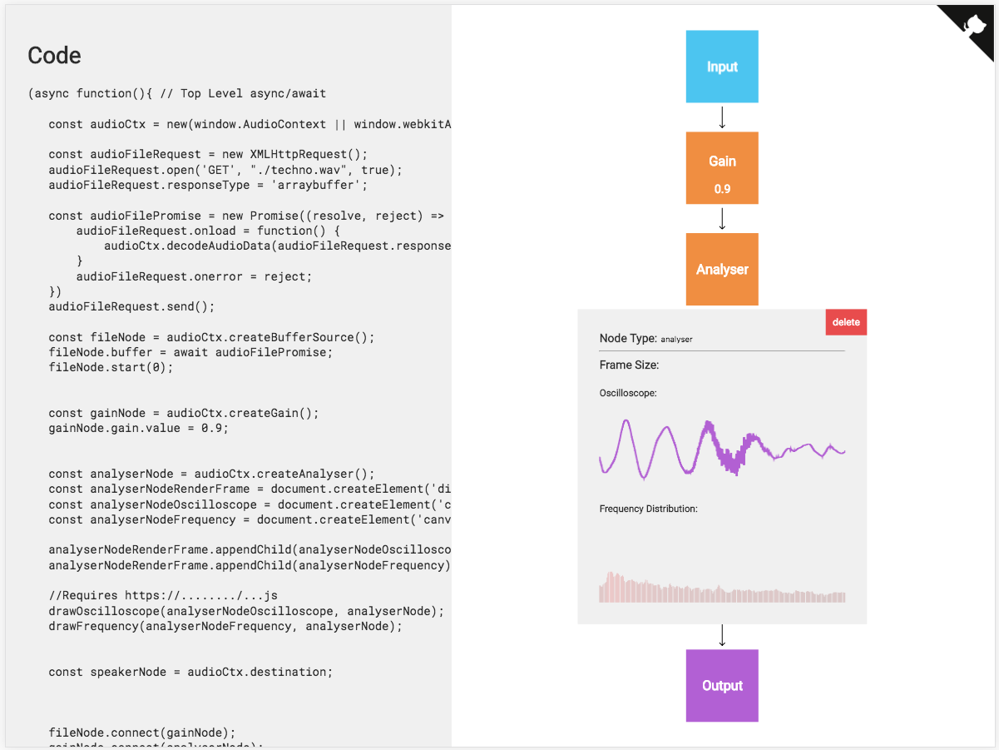
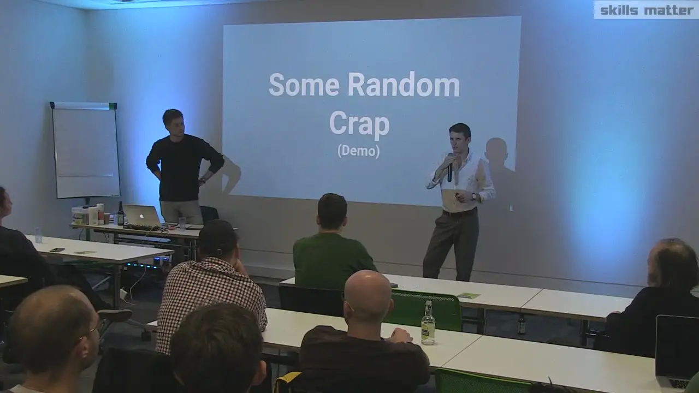

# WebAudio Generator
A UI for generating linear WebAudio code (https://webaudio.simmsreeve.com/)

[](https://www.codefactor.io/repository/github/isnit0/webaudio-generator)



## Justification
This tool was written to be used as an educational aid in a talk at [London Audio Developers Meetup](https://skillsmatter.com/groups/10788-audio-developers-meet-up).

Video available [here](https://skillsmatter.com/skillscasts/12492-audio-developers-meet-up):


## Usage
- To add a node, click on an arrow
- To "inspect" a node, click the node

## Supports
- Inputs
    - Microphone
    - File
    - Oscillator
- "Modifier" Nodes
    - WebAssembly CustomWorklet
    - Gain
    - Delay
    - BiquadFilter
    - Analyser
- Outputs
    - Speaker

## Apologies
The code was never supposed to be nice, but things got a bit out of hand...

Most of the code pretends to be immutable, but there are various places this pattern is un-expectedly broken. I foresee various painful bugs being introduced if development were to continue.

Also, I cringe at the method used to generate code. It's disgusting and you should definitely not try it at home.

## Future (See GH Issues)
- Support non-linear WebAudio graphs (probably using [Cytoscape](http://cytoscape.org/)) - Would require a re-write
- Improve UI & UX
- Output to file

## Developing
1. Don't
2. You'll need the following:

```bash
> brew install fswatch
> npm i -g browserify less

> npm i
> ./build.sh
> ./watch.sh
```

## See Also
- [PaymentRequest Generator](https://paymentrequest.simmsreeve.com)

## Useful Links
### AudioWorklet + WebAssembly
- https://developers.google.com/web/updates/2017/12/audio-worklet
- https://github.com/GoogleChromeLabs/web-audio-samples/tree/gh-pages/audio-worklet/design-pattern/wasm

## License
[MIT](./LICENSE)
